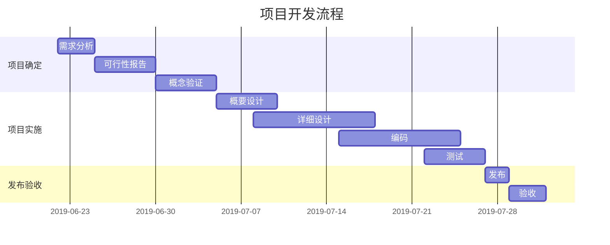
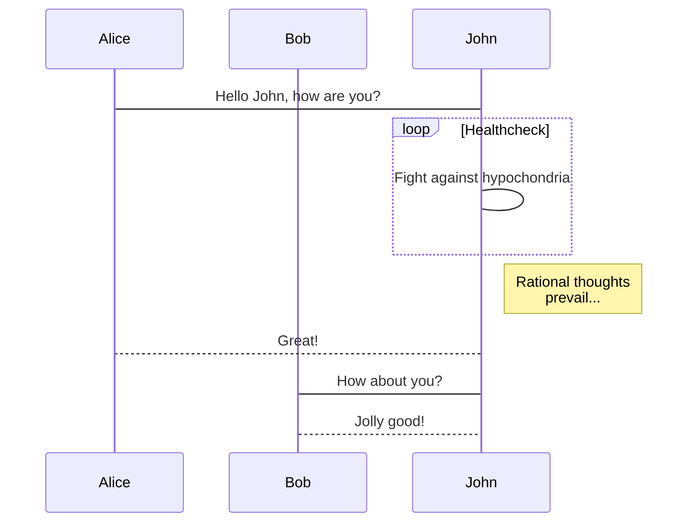
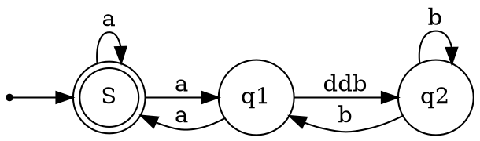

<!-- START doctoc generated TOC please keep comment here to allow auto update -->
<!-- DON'T EDIT THIS SECTION, INSTEAD RE-RUN doctoc TO UPDATE -->

- [预览设置](#%E9%A2%84%E8%A7%88%E8%AE%BE%E7%BD%AE)
- [常规用法](#%E5%B8%B8%E8%A7%84%E7%94%A8%E6%B3%95)
  - [数学公式](#%E6%95%B0%E5%AD%A6%E5%85%AC%E5%BC%8F)
  - [饼图](#%E9%A5%BC%E5%9B%BE)
  - [甘特图](#%E7%94%98%E7%89%B9%E5%9B%BE)
  - [序列图](#%E5%BA%8F%E5%88%97%E5%9B%BE)
  - [graphviz](#graphviz)
  - [流程图](#%E6%B5%81%E7%A8%8B%E5%9B%BE)
  - [脑图](#%E8%84%91%E5%9B%BE)
  - [五线谱](#%E4%BA%94%E7%BA%BF%E8%B0%B1)
- [多媒体](#%E5%A4%9A%E5%AA%92%E4%BD%93)

<!-- END doctoc generated TOC please keep comment here to allow auto update -->


### 预览设置

> vditor 语法， 与其它 markdown 编辑器语法可能有所不同，需注意
> 目录生成使用 doctoc \*.md
> [参考](https://ld246.com/guide/markdown)


这里是一个脚注引用[^1]，这里是另一个脚注引用[^bignote]。


[^1]: 第一个脚注定义。

[^bignote]: 脚注定义可使用多段内容。


### 常规用法

#### 数学公式

$$
\begin{bmatrix}
{a_{11}}&{a_{12}}&{\cdots}&{a_{1n}}\\
{a_{21}}&{a_{22}}&{\cdots}&{a_{2n}}\\
{\vdots}&{\vdots}&{\ddots}&{\vdots}\\
{a_{m1}}&{a_{m2}}&{\cdots}&{a_{mn}}\\
\end{bmatrix}
$$

$$\\frac{a}{1-a^2}$$

$$
\frac{1}{
  \Bigl(\sqrt{\phi \sqrt{5}}-\phi\Bigr) e^{
  \frac25 \pi}} = 1+\frac{e^{-2\pi}} {1+\frac{e^{-4\pi}} {
    1+\frac{e^{-6\pi}}
    {1+\frac{e^{-8\pi}}{1+\cdots}}
  }
}
$$

#### 饼图

```echarts
{"backgroundColor":"#212121","title":{"text":"「JUST」访问来源","subtext":"2019 年 6 月份","x":"center","textStyle":{"color":"#f2f2f2"}},"tooltip":{"trigger":"item","formatter":"{a} <br/>{b} : {c} ({d}%)"},"legend":{"orient":"vertical","left":"left","data":["搜索引擎","直接访问","推荐","其他","社交平台"],"textStyle":{"color":"#f2f2f2"}},"series":[{"name":"访问来源","type":"pie","radius":"55%","center":["50%","60%"],"data":[{"value":10440,"name":"搜索引擎","itemStyle":{"color":"#ef4136"}},{"value":4770,"name":"直接访问"},{"value":2430,"name":"推荐"},{"value":342,"name":"其他"},{"value":18,"name":"社交平台"}],"itemStyle":{"emphasis":{"shadowBlur":10,"shadowOffsetX":0,"shadowColor":"rgba(0, 0, 0, 0.5)"}}}]}
```

```echarts
{
  "title": { "text": "最近 30 天" },
  "tooltip": { "trigger": "axis", "axisPointer": { "lineStyle": { "width": 0 } } },
  "legend": { "data": ["帖子", "用户", "回帖"] },
  "xAxis": [{
      "type": "category",
      "boundaryGap": false,
      "data": ["2019-05-08","2019-05-09","2019-05-10","2019-05-11","2019-05-12","2019-05-13","2019-05-14","2019-05-15","2019-05-16","2019-05-17","2019-05-18","2019-05-19","2019-05-20","2019-05-21","2019-05-22","2019-05-23","2019-05-24","2019-05-25","2019-05-26","2019-05-27","2019-05-28","2019-05-29","2019-05-30","2019-05-31","2019-06-01","2019-06-02","2019-06-03","2019-06-04","2019-06-05","2019-06-06","2019-06-07"],
      "axisTick": { "show": false },
      "axisLine": { "show": false }
  }],
  "yAxis": [{ "type": "value", "axisTick": { "show": false }, "axisLine": { "show": false }, "splitLine": { "lineStyle": { "color": "rgba(0, 0, 0, .38)", "type": "dashed" } } }],
  "series": [
    {
      "name": "帖子", "type": "line", "smooth": true, "itemStyle": { "color": "#d23f31" }, "areaStyle": { "normal": {} }, "z": 3,
      "data": ["18","14","22","9","7","18","10","12","13","16","6","9","15","15","12","15","8","14","9","10","29","22","14","22","9","10","15","9","9","15","0"]
    },
    {
      "name": "用户", "type": "line", "smooth": true, "itemStyle": { "color": "#f1e05a" }, "areaStyle": { "normal": {} }, "z": 2,
      "data": ["31","33","30","23","16","29","23","37","41","29","16","13","39","23","38","136","89","35","22","50","57","47","36","59","14","23","46","44","51","43","0"]
    },
    {
      "name": "回帖", "type": "line", "smooth": true, "itemStyle": { "color": "#4285f4" }, "areaStyle": { "normal": {} }, "z": 1,
      "data": ["35","42","73","15","43","58","55","35","46","87","36","15","44","76","130","73","50","20","21","54","48","73","60","89","26","27","70","63","55","37","0"]
    }
  ]
}
```

#### 甘特图



#### 序列图



#### graphviz


#### 流程图
```flowchart
st=>start: Start
op=>operation: Your Operation
cond=>condition: Yes or No?
e=>end

st->op->cond
cond(yes)->e
cond(no)->op
```

#### 脑图

```mindmap
- 教程
- 语法指导
  - 普通内容
  - 提及用户
  - 表情符号 Emoji
    - 一些表情例子
  - 大标题 - Heading 3
    - Heading 4
      - Heading 5
        - Heading 6
  - 图片
  - 代码块
    - 普通
    - 语法高亮支持
      - 演示 Go 代码高亮
      - 演示 Java 高亮
  - 有序、无序、任务列表
    - 无序列表
    - 有序列表
    - 任务列表
  - 表格
  - 隐藏细节
  - 段落
  - 链接引用
  - 数学公式
  - 脑图
  - 流程图
  - 时序图
  - 甘特图
  - 图表
  - 五线谱
  - Graphviz
  - 多媒体
  - 脚注
- 快捷键
```

#### 五线谱

```abc
X: 24
T: Clouds Thicken
C: Paul Rosen
S: Copyright 2005, Paul Rosen
M: 6/8
L: 1/8
Q: 3/8=116
R: Creepy Jig
K: Em
|:"Em"EEE E2G|"C7"_B2A G2F|"Em"EEE E2G|\
"C7"_B2A "B7"=B3|"Em"EEE E2G|
"C7"_B2A G2F|"Em"GFE "D (Bm7)"F2D|\
1"Em"E3-E3:|2"Em"E3-E2B|:"Em"e2e gfe|
"G"g2ab3|"Em"gfeg2e|"D"fedB2A|"Em"e2e gfe|\
"G"g2ab3|"Em"gfe"D"f2d|"Em"e3-e3:|
```

### 多媒体

支持 v.qq.com，youtube.com，youku.com，coub.com，facebook.com/video，dailymotion.com，.mp4，.m4v，.ogg，.ogv，.webm，.mp3，.wav 链接解析

https://v.qq.com/x/cover/zf2z0xpqcculhcz/y0016tj0qvh.html

https://easystock.oss-cn-hangzhou.aliyuncs.com/1bcd5b76fb9a4ddcaf3d16703e94df64.mp4


- **加粗** -`**加粗**`
- *倾斜* -`*倾斜*`
- ~~删除线~~ -`~~删除线~~`
- `Code 标记` -`` `Code 标记` ``
- [超级链接](https://ld246.com) -`[超级链接](https://ld246.com)`
- [username@gmail.com](mailto:username@gmail.com) -`[username@gmail.com](mailto:username@gmail.com)`

[链接文本][链接标识]

[链接标识]: https://b3log.org

```
[链接文本][链接标识]

[链接标识]: https://b3log.org
```