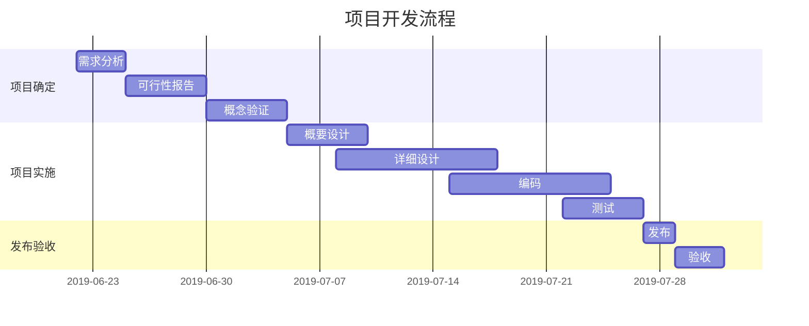
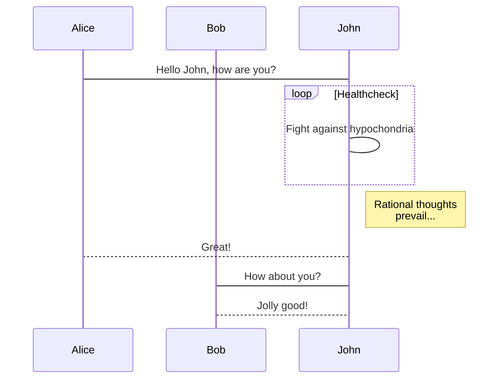

<!-- START doctoc generated TOC please keep comment here to allow auto update -->
<!-- DON'T EDIT THIS SECTION, INSTEAD RE-RUN doctoc TO UPDATE -->
**Table of Contents**  *generated with [DocToc](https://github.com/thlorenz/doctoc)*

- [目录](#%E7%9B%AE%E5%BD%95)
- [预览设置](#%E9%A2%84%E8%A7%88%E8%AE%BE%E7%BD%AE%5E1)
- [常规用法](#%E5%B8%B8%E8%A7%84%E7%94%A8%E6%B3%95)
  - [饼图](#%E9%A5%BC%E5%9B%BE)
  - [甘特图](#%E7%94%98%E7%89%B9%E5%9B%BE)
  - [序列图](#%E5%BA%8F%E5%88%97%E5%9B%BE)
  - [数学公式](#%E6%95%B0%E5%AD%A6%E5%85%AC%E5%BC%8F)

<!-- END doctoc generated TOC please keep comment here to allow auto update -->


### 预览设置

> vditor 语法， 与其它 markdown 编辑器语法可能有所不同，需注意
> 目录生成使用 doctoc *.md


### 常规用法

#### 饼图

```echarts
{"backgroundColor":"#212121","title":{"text":"「XSS」访问来源","subtext":"2019 年 6 月份","x":"center","textStyle":{"color":"#f2f2f2"}},"tooltip":{"trigger":"item","formatter":"{a} <br/>{b} : {c} ({d}%)"},"legend":{"orient":"vertical","left":"left","data":["搜索引擎","直接访问","推荐","其他","社交平台"],"textStyle":{"color":"#f2f2f2"}},"series":[{"name":"访问来源","type":"pie","radius":"55%","center":["50%","60%"],"data":[{"value":10440,"name":"搜索引擎","itemStyle":{"color":"#ef4136"}},{"value":4770,"name":"直接访问"},{"value":2430,"name":"推荐"},{"value":342,"name":"其他"},{"value":18,"name":"社交平台"}],"itemStyle":{"emphasis":{"shadowBlur":10,"shadowOffsetX":0,"shadowColor":"rgba(0, 0, 0, 0.5)"}}}]}
```

#### 甘特图



#### 序列图



#### 数学公式
$$\begin{bmatrix}
{a_{11}}&{a_{12}}&{\cdots}&{a_{1n}}\\
{a_{21}}&{a_{22}}&{\cdots}&{a_{2n}}\\
{\vdots}&{\vdots}&{\ddots}&{\vdots}\\
{a_{m1}}&{a_{m2}}&{\cdots}&{a_{mn}}\\
\end{bmatrix}$$

$$\\frac{a}{1-a^2}$$

